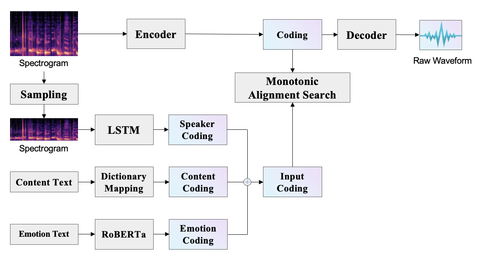

# EMOTTS: Multilingual Emotion-Controlled Voice Cloning Text-to-Speech System



## Create Env
```
conda create -n emo python=3.8
conda activate emo
```

## Install packages

```
pip install -r requirements.txt
python env.py
```

## Download Pre-trained Model

Download the model by this [link](https://huggingface.co/hfl/chinese-roberta-wwm-ext/tree/main), and then put them into /chinese-roberta-wwm-ext

## Collecting Data

Collet the data by [this](https://github.com/LuckyBian/DialogExtractor)

## Preprocessing

Use [this code](https://github.com/LuckyBian/GPTSOVITS2) to complete the following preprocessing:

1. Change the audio to single channel, sampling rate to 22050, format to wav.
2. Merge and slice the audio into 10s segments.
3. Use ASR technology to recognize text in speech.
4. Store the audio, emotion and text in 3 folders with corresponding file names.

```
# The audio path and corresponding text and emotion are stored and divided into training set and validation set.
python getdata.py
python split.py
```

## Build Monotonic Alignment Search

```
cd monotonic_align
python setup.py build_ext --inplace
cd ..
```

## Training
```
python train.py -c path/to/json -m model
```


## Inference
```
python infer.py
```
